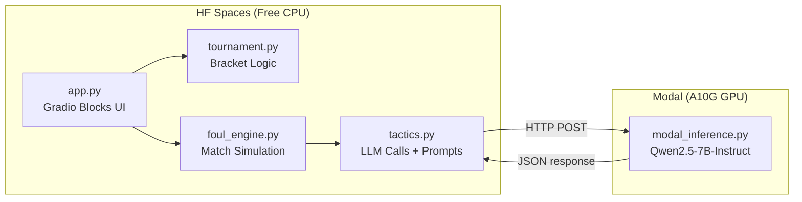

# Foul Cup — Implementation Plan

An inverted football tournament where fouls, cards, and dirty play win matches. Built as a Gradio app for Hugging Face Spaces with a Modal-hosted Qwen2.5-7B-Instruct LLM backend.

---

## User Review Required

> [!IMPORTANT]
> **Modal Endpoint URL**: The app reads `MODAL_ENDPOINT_URL` from an environment variable (HF Spaces Secret). You must deploy `modal_inference.py` separately via `modal deploy modal_inference.py` and store the resulting URL as a secret in your HF Space.

> [!WARNING]
> **Modal Cold Starts**: The first LLM call after a cold start takes ~60–90s (model loading). Subsequent calls are fast. The app includes fallback logic so matches never stall — it uses templated responses when the endpoint is slow or down.

> [!NOTE]
> **Modal decorator**: Using `@modal.fastapi_endpoint()` (the modern Modal SDK pattern) instead of the older `@modal.web_endpoint`.

## Open Questions

1. **Team count in default pool**: The spec lists 12 default nations. Should the user be able to add custom teams *beyond* 8 selected (i.e., add to the pool, then pick 8), or does a custom team automatically replace one of the 12 defaults in the pool? → **I'll implement: custom teams are added to the pool, user still selects exactly 8 from the expanded pool.**

2. **Match seed**: ~~Internal, derived from team names + round index.~~ → **Updated: Use `time.time()` so every user session gets a unique sequence of events for the same matchup.**

3. **HF Space `requirements.txt`**: The Space will need `gradio`, `requests`, `python-dotenv`. Should I also generate a `README.md` with HF Spaces YAML frontmatter? → **I'll include it.**

---

## Architecture Overview



**Data flow per match tick:**
1. `app.py` game loop calls `foul_engine.simulate_tick()`
2. Engine calls `tactics.get_actions()` → batched Modal call (3 actions per request)
3. Engine resolves each action against team ratings + RNG → produces events
4. Events returned to `app.py` → yielded to Gradio for live UI update
5. Major events trigger a second Modal call for commentary

---

## Proposed Changes

### 1. Modal LLM Backend

#### [NEW] [modal_inference.py](file:///c:/Users/USER/Desktop/Projects/Aggressive_cup/modal_inference.py)

Deploys Qwen2.5-7B-Instruct on an A10G GPU as a POST endpoint.

**Key design decisions:**
- Uses `@app.cls()` with `@modal.enter()` to load the model once per container (avoids reloading on every request)
- Model loaded in `bfloat16` with `device_map="auto"` (~14GB VRAM on 24GB A10G)
- Uses `@modal.fastapi_endpoint()` (modern Modal SDK pattern)
- Accepts `{"prompt": str, "max_new_tokens": int}` → returns `{"text": str}`
- Optional `@modal.build()` hook to pre-download weights into the image layer

```python
# Pseudocode structure
@app.cls(gpu="A10G", image=image, container_idle_timeout=300)
class FoulCupLLM:
    @modal.build()
    def download_model(self):
        # Pre-download Qwen2.5-7B-Instruct weights

    @modal.enter()
    def load_model(self):
        # Load model + tokenizer into self.model, self.tokenizer

    @modal.fastapi_endpoint(method="POST")
    def generate(self, item: dict):
        # Tokenize item["prompt"], generate, decode, return {"text": ...}
```

---

### 2. Foul Engine

#### [NEW] [foul_engine.py](file:///c:/Users/USER/Desktop/Projects/Aggressive_cup/foul_engine.py)

Core match simulation. All randomness seeded. No LLM calls here.

**Data models (dataclasses):**

| Class | Fields |
|-------|--------|
| `Player` | `name: str`, `aggression: int`, `cynicism: int`, `theatrics: int`, `stamina: int`, `dirty_tricks: int`, `yellow_cards: int`, `red_carded: bool` |
| `Team` | `name: str`, `emoji: str`, `players: list[Player]`, `tactic: str` |
| `MatchEvent` | `minute: int`, `event_type: EventType`, `team: str`, `player: str`, `points: int`, `description: str` |
| `MatchState` | `home: Team`, `away: Team`, `home_score: int`, `away_score: int`, `minute: int`, `events: list[MatchEvent]`, `half: str`, `is_extra_time: bool`, `home_stats: dict`, `away_stats: dict`, `rng: random.Random` |

**`EventType` enum:**
`KICK_OFF`, `REGULAR_FOUL`, `YELLOW_CARD`, `RED_CARD`, `PENALTY_CONCEDED`, `VIOLENT_CONDUCT`, `DIVE_SUCCESS`, `DIVE_FAILED`, `HALF_TIME`, `FULL_TIME`, `EXTRA_TIME_FOUL`

**Key functions:**

| Function | Purpose |
|----------|---------|
| `create_match(home, away, seed)` | Initialize `MatchState` with seeded RNG |
| `resolve_action(state, team, action, player)` | Takes a tactical action string, rolls against player ratings, returns `MatchEvent` |
| `pick_active_player(team, rng)` | Weighted random selection from non-red-carded players, biased by stamina |
| `check_violent_conduct(player, rng)` | ~5% base chance, boosted by `dirty_tricks` rating |
| `check_dive(player, rng)` | Success probability based on `theatrics` rating |
| `apply_event(state, event)` | Mutate match state: update scores, stats, card tracking |
| `get_top_fouler(team_name, events)` | Player with most foul points for display |

**Action resolution logic:**
- `FOUL` → always produces at least `REGULAR_FOUL` (+1). Then roll for yellow card (~20% base, boosted by cynicism). Then roll for violent conduct (~5%, boosted by dirty_tricks).
- `DIVE` → roll against theatrics. Success → `DIVE_SUCCESS` (+2). Fail → `DIVE_FAILED` → yellow card for simulation (+3).
- `INTIMIDATE` → high chance of `YELLOW_CARD` (~40% base, boosted by aggression).
- `PROVOKE` → opponent may foul back → `PENALTY_CONCEDED` for opponent (+2 to provoking team).
- `TACKLE` → `REGULAR_FOUL` with chance of escalation to `RED_CARD`.
- `WASTE_TIME` → small chance of `YELLOW_CARD` for time wasting.
- `PRESS` → `REGULAR_FOUL` with low escalation chance.

**Double yellow → red card logic:** Tracked per player. On second yellow, automatically convert to red card event (+5 pts total: 3+3 from yellows, but red card replaces the second yellow awarding +5 instead of +3 for the triggering event). Player marked `red_carded=True`.

**Default teams (12):**

| Team | 🏴 | Aggression | Cynicism | Theatrics | Stamina | Dirty Tricks |
|------|----|-----------|----------|-----------|---------|-------------|
| Argentina | 🇦🇷 | 75 | 80 | 85 | 70 | 75 |
| Brazil | 🇧🇷 | 65 | 70 | 95 | 75 | 60 |
| Germany | 🇩🇪 | 80 | 90 | 40 | 85 | 70 |
| France | 🇫🇷 | 70 | 75 | 70 | 80 | 65 |
| Spain | 🇪🇸 | 60 | 65 | 85 | 75 | 55 |
| England | 🏴󠁧󠁢󠁥󠁮󠁧󠁿 | 90 | 70 | 50 | 85 | 80 |
| Portugal | 🇵🇹 | 70 | 75 | 90 | 70 | 60 |
| Netherlands | 🇳🇱 | 85 | 80 | 55 | 80 | 75 |
| Croatia | 🇭🇷 | 75 | 85 | 60 | 80 | 70 |
| Morocco | 🇲🇦 | 80 | 70 | 65 | 90 | 65 |
| Italy | 🇮🇹 | 70 | 90 | 80 | 75 | 70 |
| Japan | 🇯🇵 | 55 | 60 | 45 | 95 | 40 |

Each team has 3 named players — real-world-inspired stereotype names (e.g., Argentina: "Ramos Jr.", "El Carnicero", "Maradona's Ghost").

---

### 3. Tactical AI

#### [NEW] [tactics.py](file:///c:/Users/USER/Desktop/Projects/Aggressive_cup/tactics.py)

Handles LLM prompt construction, Modal HTTP calls, response parsing, and commentary generation.

**Constants:**
- `MODAL_ENDPOINT_URL` — read from `os.environ.get("MODAL_ENDPOINT_URL")`
- `VALID_ACTIONS` — `["FOUL", "DIVE", "INTIMIDATE", "PROVOKE", "TACKLE", "WASTE_TIME", "PRESS"]`
- `TACTIC_MODIFIERS` — dict mapping tactic names to prompt modifier strings

**Tactic modifier strings:**

| Tactic | Modifier |
|--------|----------|
| The Chopper | "Maximum fouls, no subtlety. Hack everything that moves." |
| The Diver | "Win penalties through theatrical diving. Every touch is agony." |
| The Intimidator | "Rack up yellow cards deliberately. Fear is the weapon." |
| The Enforcer | "Target the opposition's key players. Make them suffer." |
| The Time Waster | "Slow the game down. Waste every second. Provoke reactions." |

**Key functions:**

| Function | Signature | Purpose |
|----------|-----------|---------|
| `get_actions` | `(team, minute, h_pts, a_pts, tactic) → list[str]` | Request 3 actions from LLM in one call. Parse response. Fallback to random. |
| `get_major_commentary` | `(minute, event_type, team, player) → str` | One-sentence outraged commentary for major events. |
| `get_post_match_report` | `(home, away, h_pts, a_pts, events) → str` | 2–3 sentence appalled pundit summary. |
| `_call_modal` | `(prompt, max_new_tokens) → str or None` | HTTP POST to Modal. 10s timeout. Returns None on failure. |
| `_parse_actions` | `(raw_text) → list[str]` | Extract valid action words from response. |
| `get_minor_commentary` | `(minute, event, team, player) → str` | Template-based, no LLM. |

**Action prompt (batched, 3 actions):**
```
You are the dirty tactics coach of {team}. Style: {tactic_modifier}.
Minute {minute}. Score: {h_pts}-{a_pts}. Possession: {team}.
Choose three actions from: FOUL DIVE INTIMIDATE PROVOKE TACKLE WASTE_TIME PRESS
Reply with three words only, separated by spaces.
```

**Commentary templates (minor events):**
Pre-written lists of 8–10 templates per event type with `{player}`, `{team}` placeholders. Selected randomly.

---

### 4. Tournament

#### [NEW] [tournament.py](file:///c:/Users/USER/Desktop/Projects/Aggressive_cup/tournament.py)

Manages the bracket structure and advancement.

**Data models:**

| Class | Fields |
|-------|--------|
| `MatchResult` | `home: str`, `away: str`, `home_score: int`, `away_score: int`, `winner: str`, `events: list` |
| `Tournament` | `teams: list[Team]`, `bracket: dict`, `current_round: str`, `current_match_idx: int`, `history: list[str]`, `champion: str or None` |

**Bracket structure (dict):**
```python
{
    "QF": [(team1, team2), (team3, team4), (team5, team6), (team7, team8)],
    "SF": [None, None],  # filled as QF winners advance
    "Final": [None],
    "results": {"QF": [], "SF": [], "Final": []}
}
```

**Key functions:**

| Function | Purpose |
|----------|---------|
| `create_tournament(teams: list[Team])` | Shuffle & seed bracket, return `Tournament` |
| `get_current_matchup()` | Return the next unplayed `(home, away)` pair |
| `record_result(result: MatchResult)` | Store result, advance winner to next round |
| `is_finished()` | True if Final has a result |
| `get_champion()` | Return winning team |
| `format_bracket_display()` | Generate text/HTML bracket for UI |
| `format_history()` | Compact log strings for tournament history |

---

### 5. Gradio Frontend

#### [NEW] [app.py](file:///c:/Users/USER/Desktop/Projects/Aggressive_cup/app.py)

The main Gradio Blocks application. Two tabs: **Setup** and **Live Match**.

**CSS theme:** Custom dark theme via `gr.Blocks(css=custom_css)`:
- Background: `#0a0a0a` (near black)
- Primary accent: `#8b0000` (dark red)
- Secondary: `#1a1a2e` (dark navy)
- Yellow card accent: `#FFD700`
- Red card accent: `#FF2020`
- Text: `#e0e0e0`
- Font: Inter (via Google Fonts `@import`)

**Layout structure:**

```
┌─────────────────────────────────────────────────┐
│  🏆 FOUL CUP  │  HACKATHON  │ Setup │ Live Match│  ← Top bar
├─────────────────────────────────────────────────┤
│                                                 │
│  TAB: SETUP                                     │
│  ┌─────────────────────────────────────────┐    │
│  │  SELECT 8 PARTICIPATING TEAMS           │    │
│  │  ┌────┐ ┌────┐ ┌────┐ ┌────┐ ┌────┐    │    │
│  │  │🇦🇷  │ │🇧🇷  │ │🇩🇪  │ │🇫🇷  │ │🇪🇸  │    │    │
│  │  └────┘ └────┘ └────┘ └────┘ └────┘    │    │
│  │  ┌────┐ ┌────┐ ┌────┐ ┌────┐ ...       │    │
│  │  │🏴󠁧󠁢󠁥󠁮󠁧󠁿  │ │🇵🇹  │ │🇳🇱  │ │🇭🇷  │          │    │
│  │  └────┘ └────┘ └────┘ └────┘           │    │
│  │  "Select 8 teams. The dirtiest wins."   │    │
│  │─────────────────────────────────────────│    │
│  │  CUSTOM TEAM CREATOR                    │    │
│  │  [Team Name] [P1] [P2] [P3] [Tactic ▼] │    │
│  │  [ Create & Add Team ]                  │    │
│  └─────────────────────────────────────────┘    │
│                                                 │
│        [ 🏆 START FOUL CUP ]                    │
│                                                 │
├─────────────────────────────────────────────────┤
│                                                 │
│  TAB: LIVE MATCH                                │
│  ┌─────────────────────────────────────────┐    │
│  │  FOUL CUP BRACKET                      │    │
│  │  QF        │  SF       │  FINAL  🏆     │    │
│  │  A vs B    │           │                │    │
│  │  C vs D    │  W1 vs W2 │                │    │
│  │  E vs F    │           │  W5 vs W6      │    │
│  │  G vs H    │  W3 vs W4 │                │    │
│  └─────────────────────────────────────────┘    │
│  ┌─────────────────────────────────────────┐    │
│  │  TOURNAMENT HISTORY (compact log)       │    │
│  └─────────────────────────────────────────┘    │
│  ┌─────────────────────────────────────────┐    │
│  │  LIVE MATCH SCOREBOARD                  │    │
│  │  🇦🇷 Argentina  14 - 9  France 🇫🇷       │    │
│  │  ⭐ Ramos (8pts)    ⭐ Mbappé (5pts)    │    │
│  │  ⏱ 34:22  🔴 LIVE                      │    │
│  └─────────────────────────────────────────┘    │
│  ┌──────────────────┬──────────────────────┐    │
│  │  COMMENTARY (60%) │  STATISTICS (40%)   │    │
│  │  00:08 Ramos...   │  Foul Pts: 14 - 9  │    │
│  │  00:21 YELLOW!    │  Fouls:     6 - 4   │    │
│  │  ...              │  Yellows:   2 - 1   │    │
│  └──────────────────┴──────────────────────┘    │
│  ┌─────────────────────────────────────────┐    │
│  │  POST-MATCH REPORT (appears at FT)      │    │
│  │  "Argentina put on a masterclass..."     │    │
│  │  [ Advance → ]  [ Full Dirty Report ]   │    │
│  └─────────────────────────────────────────┘    │
│                                                 │
└─────────────────────────────────────────────────┘
```

**Implementation approach for the team selection grid:**
- Use `gr.CheckboxGroup` is too plain. Instead, use `gr.HTML` with clickable cards + `gr.State` to track selections, and JavaScript event listeners via `gr.HTML` + a hidden `gr.JSON` component to shuttle selection state into Python.
- Alternative: Use `gr.DataFrame` with selectable rows — but this is also plain.
- **Best approach:** Use `gr.CheckboxGroup` with custom CSS to style checkboxes as cards. Gradio's `elem_classes` param allows CSS targeting. Each option is `"🇦🇷 Argentina"` etc.

**Game loop (generator function):**

```python
def run_match(tournament_state):
    match_state = create_match(home, away, seed)

    # First half: 60 seconds → 45 in-game minutes
    for real_sec in range(60):
        minute = int(real_sec * 45 / 60)
        actions = get_actions(...)  # 3 actions batched
        for action in actions:
            player = pick_active_player(...)
            event = resolve_action(state, team, action, player)
            apply_event(state, event)
            commentary = get_commentary(event)
            yield build_ui_update(state, commentary)
        time.sleep(1)

    # Half time
    yield half_time_update(state)
    time.sleep(5)

    # Second half: same structure, minutes 45-90
    ...

    # Extra time if tied
    if state.home_score == state.away_score:
        # First foul wins
        ...

    # Post-match report
    report = get_post_match_report(...)
    yield final_update(state, report)
```

**Gradio components and their update targets:**

| Component | Type | Updated by |
|-----------|------|-----------|
| `bracket_html` | `gr.HTML` | `format_bracket_display()` |
| `history_html` | `gr.HTML` | `format_history()` |
| `scoreboard_html` | `gr.HTML` | Each tick yield |
| `commentary_html` | `gr.HTML` | Appended each event |
| `stats_html` | `gr.HTML` | Each tick yield |
| `report_html` | `gr.HTML` | Post-match only |
| `advance_btn` | `gr.Button` | Visible after FT |
| `team_selection` | `gr.CheckboxGroup` | Setup tab |
| `tournament_state` | `gr.State` | Stores Tournament object |

**Multiple output yield:** Each `yield` returns a tuple updating all live components simultaneously.

---

### 6. Supporting Files

#### [NEW] [requirements.txt](file:///c:/Users/USER/Desktop/Projects/Aggressive_cup/requirements.txt)
```
gradio
requests
python-dotenv
```

#### [NEW] [README.md](file:///c:/Users/USER/Desktop/Projects/Aggressive_cup/README.md)
HF Spaces YAML frontmatter:
```yaml
---
title: Foul Cup
emoji: 🏆
colorFrom: red
colorTo: black
sdk: gradio
sdk_version: "5.x"
app_file: app.py
pinned: false
---
```

#### [NEW] [.env.example](file:///c:/Users/USER/Desktop/Projects/Aggressive_cup/.env.example)
```
MODAL_ENDPOINT_URL=https://your-modal-endpoint-url.modal.run
```

---

## Implementation Order

| Step | File | Est. Complexity |
|------|------|----------------|
| 1 | `foul_engine.py` | High — core game logic, data models, all event resolution |
| 2 | `tactics.py` | Medium — prompts, HTTP calls, parsing, templates |
| 3 | `tournament.py` | Low — bracket management, straightforward |
| 4 | `modal_inference.py` | Medium — Modal deployment, model loading |
| 5 | `app.py` | High — Gradio UI, CSS, game loop, streaming |
| 6 | `requirements.txt`, `README.md`, `.env.example` | Trivial |

This order ensures each layer can be built and tested independently. `foul_engine.py` has zero external dependencies. `tactics.py` depends only on `requests`. `tournament.py` depends on `foul_engine` types. `app.py` ties everything together.

---

## Verification Plan

### Automated Tests
```bash
# Run the Gradio app locally (no Modal needed — fallback mode)
python app.py

# Deploy Modal endpoint
modal deploy modal_inference.py

# Test Modal endpoint directly
curl -X POST $MODAL_ENDPOINT_URL -H "Content-Type: application/json" \
  -d '{"prompt": "Say hello", "max_new_tokens": 10}'
```

### Manual Verification
1. **Setup tab**: Select 8 teams from the grid, verify selection highlighting, create a custom team, verify it appears in the grid
2. **Start tournament**: Click START FOUL CUP, verify bracket populates with 4 QF matchups
3. **Match simulation**: Watch a full match, verify:
   - Commentary streams line-by-line
   - Scoreboard updates in real-time
   - Match clock progresses 0:00 → 45:00 → 90:00
   - Yellow/red card colors appear correctly
   - Stats panel updates each tick
4. **Post-match**: Verify report appears, Advance button works, next match starts
5. **Full tournament**: Play through QF → SF → Final, verify champion is crowned
6. **Fallback mode**: Stop Modal endpoint, run a match, verify random actions are used and the app doesn't crash
7. **Extra time**: Engineer a tied match (same seed), verify sudden death works
